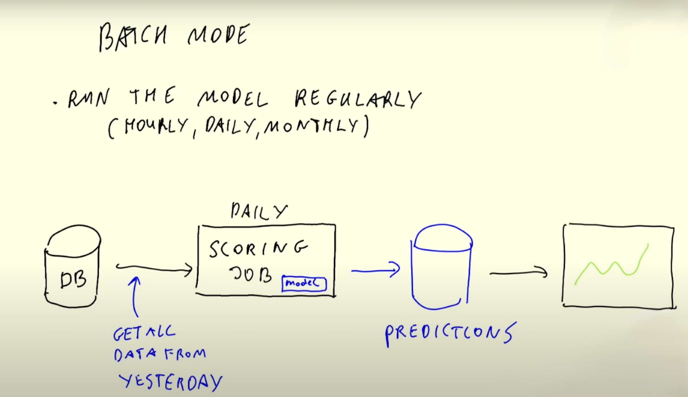
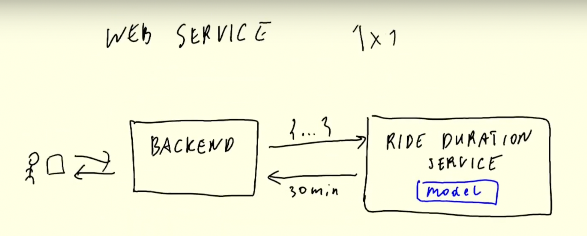
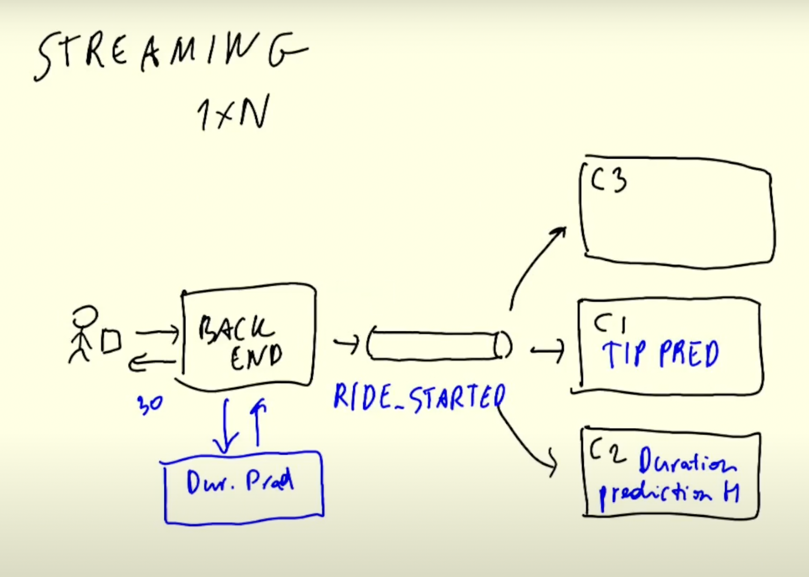
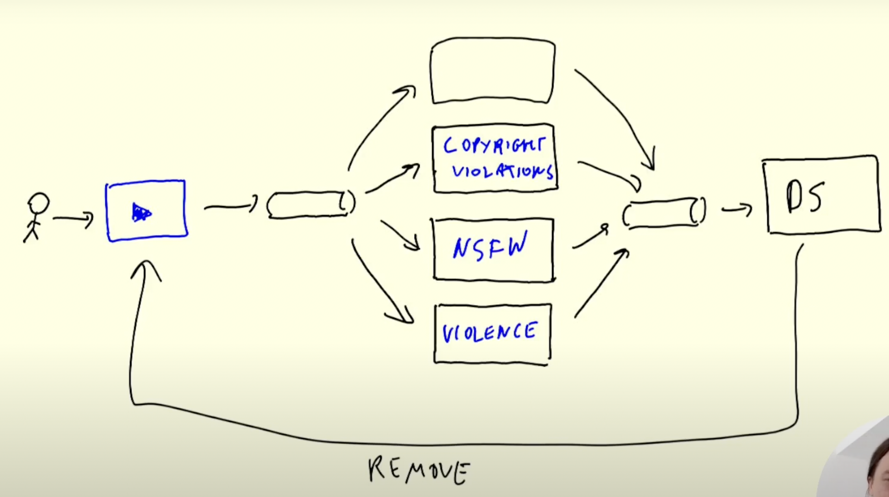

# Workflow Deployment

## Table of contents

1. Deployment Types
     
     1.1. Offline (Batch Deployment)
     
     1.2. Online Deployment
         - Web Service
         - Streaming

# 1. Deployment Types
There are 2 types/paradigms or deployment:

There are two main types of deployment for machine learning models:

## 1.1. Offline (Batch Deployment)

This type of deployment **is not for real-time predictions**. Instead, it makes predictions at regular intervals such as hourly, daily, or monthly. Here’s how it works:

1. We have a database and a scoring job (model).
2. The scoring job periodically pulls data from the database whenever it needs to.
3. The model runs on this data and writes the results to a predictions database.

**Example:** Churn prediction job that runs every night giving results at morning.

## 1.2. Online Deployment

The model is always available for prediction. There are two ways to deploy an online model:

### Web Service

In this method, the model provides **real-time predictions at set intervals (hourly, daily, monthly)**.
- The relationship between the client (the Backend in this case) and the model is 1 to 1.

**Example:** Trip duration prediction at Uber.

### Streaming

In this method, there is **no direct connection between the producers (who produce data) and the consumers (who make predictions)**. They communicate via a data stream.
- We have producers and consumers.
- The producer pushes data into a data stream.
- Consumers get the data from the stream for their tasks.

The relationship between the client (the Backend in this case) and the model is 1 to N.

**Example:** 
- The backend (producer) pushes data into the data stream along with an event like Ride_started.
- Consumer 1 (C1) predicts the duration.
- Consumer 2 (C2) predicts the cost.
- Consumer 3 (C3) predicts the tip, etc.

Consumers can also push their predictions to a prediction stream, and a decision service will act on their predictions.

**Example:**
1. A YouTuber updates their content on the platform.
2. The data is sent to the stream.
3. Consumers (different models) make predictions based on this data.
4. The predictions are sent to a prediction stream.
5. The final decision is sent to the producer (User).

## Notes:
1. Offline: **Offline - Batch.md**
2. Online:
   - Web service: 
     * Web service: **Online - Web service.md**
     * web-service-mlflow: **Online - Web service (MLflow).md**
   - Streaming:
     * Streaming: **Online - Streaming.md**